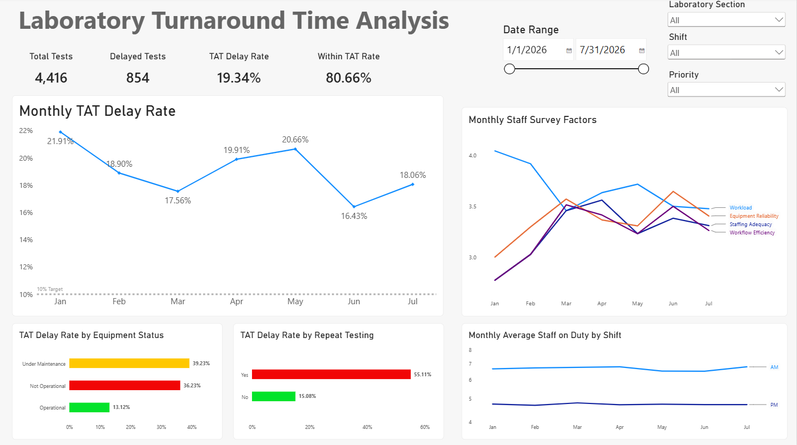

# Clinical Laboratory Turnaround Time (TAT) Analysis

## Problem Statement

Laboratory test results experienced delayed turnaround time from January to July 2026, with an average monthly delay rate of **19.06%**, consistently exceeding the laboratory target of <10% per month.

## Data

The project uses clinical laboratory data covering January to July 2026.

- **4,416 laboratory test records** containing test date, laboratory section, test name, priority, turnaround time, repeat testing, staff on duty, equipment status, and TAT status.
- **272 staff survey responses** containing workload, staffing adequacy, equipment reliability, repeat testing manageability, workflow efficiency, overall satisfaction, and overtime information.
- **Shift reference data** defining AM and PM laboratory shifts and their standard staffing levels.

## Methodology

- **Excel**
- **SQL (SQLite/DBeaver)**
- **Power BI**

## Dashboard

## Insights

- The laboratory recorded an **average monthly TAT delay rate of 19.06%**, with every month exceeding the target of **<10%**.
- **January had the highest monthly delay rate at 21.91%**, while **June had the lowest at 16.43%**.
- Tests with **repeat testing** had a substantially higher delay rate (**55.11%**) than tests without repeat testing (**15.08%**).
- Equipment status was associated with TAT performance. Tests performed while equipment was **under maintenance (39.23%)** or **not operational (36.23%)** had higher delay rates than those performed with **operational equipment (13.12%)**.
- Staffing and staff survey indicators varied across the seven-month period, but their relationship with TAT delays was not consistent, suggesting that staffing levels alone may not explain the observed delays.

## Recommendations

- **Review staffing levels against the established shift standards**

- **Investigate and reduce avoidable repeat testing**

- **Strengthen preventive maintenance and equipment downtime management**
